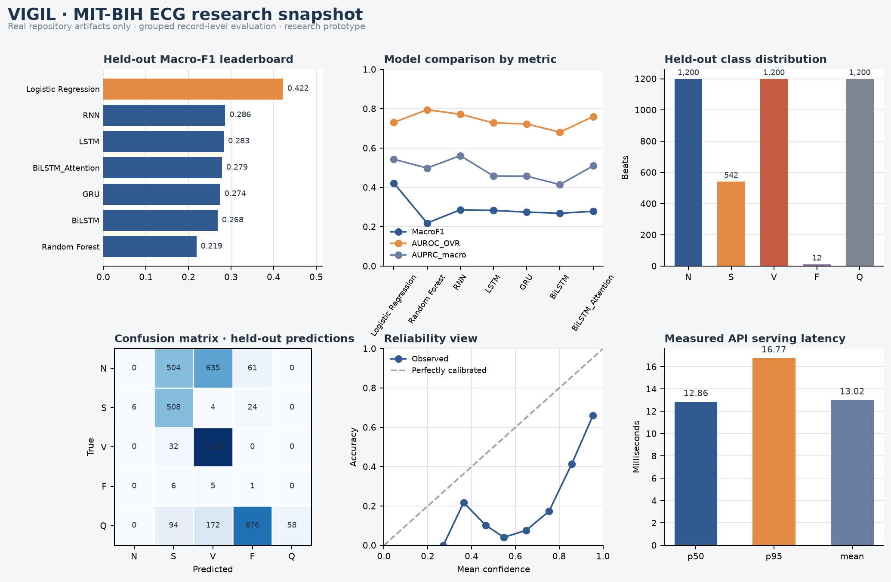
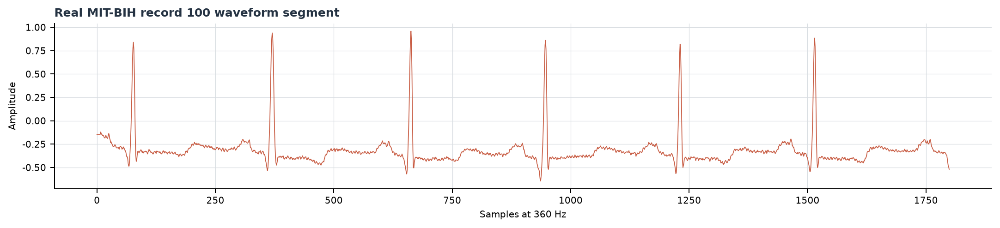

# VIGIL

## Interpretable Temporal Deep Learning for ECG Arrhythmia Classification

VIGIL is a retrospective ECG research workstation for five-class MIT-BIH arrhythmia classification. It combines leakage-safe record-level evaluation, classical morphology baselines, temporal neural models, model explanations, FastAPI inference, and a dense SQL-workbench-inspired analytics interface.

> **Research scope.** VIGIL is a retrospective research prototype, not a medical diagnostic device. Its predictions must not be used to make treatment decisions or to imply clinical deployment readiness.

## What changed in this version

The frontend now follows the supplied query-editor and result-grid reference rather than a generic SaaS dashboard. The primary screen is organized as a database workbench: a dark SQL-like analysis editor, a light query-result table, a connections tree, compact worksheet output, and dense result panels. The ECG waveform remains the dominant visual, but it is presented as an analysis result alongside class probabilities, attention, benchmark rows, and API status.

The README now includes visual summaries generated directly from the repository artifacts. No benchmark number shown below is a placeholder or an invented target.



*Figure 1. Real held-out benchmark, class distribution, confusion matrix, reliability, and serving-latency snapshot generated from committed artifacts.*



*Figure 2. Real MIT-BIH record-100 waveform segment bundled for live API and UI validation.*

## Dataset and five-class target

The project uses the Kaggle mirror [`abdallahwagih/mit-bih-arrhythmia-database`](https://www.kaggle.com/datasets/abdallahwagih/mit-bih-arrhythmia-database), based on the MIT-BIH Arrhythmia Database. The current target is a five-class research mapping:

| Class | Annotation symbols |
|---|---|
| N | N, L, R, e, j |
| S | A, a, J, S |
| V | V, E |
| F | F |
| Q | Q, /, f |

Each beat uses 90 samples before and 90 samples after the annotation at 360 Hz. The temporal input contains the current beat plus up to seven preceding beats, giving an input shape of `8 × 180`.

## Leakage-safe evaluation

Splitting occurs by record/subject group before beat-sequence construction. Beats from a held-out record cannot appear in the training or validation set. Within a record, sequence history preserves chronological order and uses only current and preceding beats. The implementation is in `notebooks/mitbih_arrhythmia_research.ipynb`.

## Measured benchmark snapshot

The current committed run is a DEBUG-mode research run. It intentionally does **not** force the attention model to win. The measured result is more interesting: Logistic Regression has the strongest Macro-F1 overall, Random Forest has the strongest AUROC and lowest ECE in the current comparison, and the plain RNN is the strongest neural model by Macro-F1.

| Model | Accuracy | Macro-F1 | AUROC OVR | AUPRC Macro | ECE |
|---|---:|---:|---:|---:|---:|
| Logistic Regression | 0.564 | **0.422** | 0.730 | 0.543 | 0.374 |
| Random Forest | 0.384 | 0.219 | **0.795** | 0.498 | **0.209** |
| RNN | 0.418 | **0.286 among neural models** | 0.772 | **0.561** | 0.401 |
| LSTM | 0.406 | 0.283 | 0.728 | 0.458 | 0.401 |
| GRU | 0.403 | 0.274 | 0.723 | 0.457 | 0.410 |
| BiLSTM | 0.374 | 0.268 | 0.681 | 0.415 | 0.467 |
| BiLSTM + Attention | 0.408 | 0.279 | 0.760 | 0.509 | 0.440 |

The full result files are `ml/metrics/model_comparison.csv` and `ml/metrics/metrics.json`. The dashboard consumes these files through `GET /metrics`; it does not hardcode the table.

## Research question

The project is framed around a stronger question than “which model has the highest score?”:

> **What does temporal deep learning add over classical ECG morphology features under patient- or record-level evaluation?**

That question explains why the classical baselines remain first-class citizens in the benchmark. It also motivates the next experimental layers rather than treating a single seed and a single split as universal truth.

## Planned research extensions

The attached research specification proposes the following upgrades. They are represented as an explicit roadmap, not as completed results. The repository will only report an experiment after the corresponding data, split, and measurements have actually been run.

| Layer | Planned experiment | Status in this repository |
|---|---|---|
| Representation | Compare waveform-only, waveform + RR, waveform + morphology, and waveform + RR + morphology inputs. | Roadmap; current committed run is waveform sequence only. |
| Features | Add previous/next RR, local heart rate, QRS duration, amplitude statistics, energy, slope, and zero-crossing descriptors. | Roadmap; no fabricated feature-ablation scores are reported. |
| Architecture | Add CNN → Bi-LSTM → Temporal Attention to separate local morphology learning from beat-to-beat context. | Roadmap; current repository already contains Bi-LSTM + Attention, but not the CNN front end. |
| Seed stability | Run seeds 42–46 and report mean ± standard deviation. | Roadmap; current run is seed 42. |
| Uncertainty | Bootstrap held-out predictions for confidence intervals on AUROC and Macro-F1. | Roadmap; current metrics are point estimates. |
| Generalization | Compare random record split, grouped split, and harder record-family/subject-grouped evaluation where supported by the data. | Roadmap; current split is grouped and leakage-safe. |
| Calibration | Compare uncalibrated probabilities with temperature scaling and report ECE before/after. | Partial; current ECE is measured, temperature scaling is not yet run. |
| Cost sensitivity | Evaluate class-weighted and cost-matrix-aware training with per-class false-negative rates. | Partial; class weighting exists, cost-matrix training is not yet run. |
| Robustness | Measure degradation under Gaussian noise, baseline wander, amplitude scaling, missing samples, and motion-artifact-like corruption. | Roadmap; no synthetic corruption scores are claimed. |
| Efficiency | Report parameter count, model size, p50/p95 latency, and CPU trade-offs for each model. | Partial; model metadata and live RNN API latency are committed. |

## Architecture

```text
ECG waveform
    ↓
WFDB beat extraction + robust normalization
    ↓
Grouped record/subject split + chronological 8-beat sequence construction
    ↓
Logistic Regression / Random Forest / RNN / LSTM / GRU / Bi-LSTM
    ↓
Bi-LSTM + Temporal Attention benchmark
    ↓
Probabilities + attention + Integrated Gradients + held-out errors
    ↙                                             ↘
FastAPI inference and evaluation API          SQL-workbench analytics UI
```

## Repository layout

| Path | Purpose |
|---|---|
| `notebooks/` | Original and executed MIT-BIH research notebooks. |
| `ml/models/` | RNN, LSTM, GRU, BiLSTM, BiLSTM + Attention, and active checkpoints. |
| `ml/configs/` | Label mapping, preprocessing, inference bundle, and experiment configuration. |
| `ml/metrics/` | Benchmark tables, full metrics JSON, training histories, and serving latency. |
| `ml/predictions/` | Held-out predictions used by the result-grid and error-analysis views. |
| `ml/explanations/` | Integrated Gradients arrays/images and explanation artifacts. |
| `ml/plots/` | Research plots exported by the notebook. |
| `docs/` | README-ready graphs and waveform visualizations generated from committed artifacts. |
| `api/` | FastAPI health, model, metrics, record, explanation, and prediction endpoints. |
| `src/` | React/Vite SQL-workbench-style VIGIL interface. |
| `scripts/` | Smoke tests, API examples, serving benchmark, and README visualization generator. |

## Run the API

```bash
python -m venv .venv
source .venv/bin/activate
pip install -r requirements.txt
uvicorn api.main:app --reload --port 8000
```

| Endpoint | Purpose |
|---|---|
| `GET /health` | API and model status. |
| `GET /model` | Model version, classes, input contract, and available checkpoints. |
| `GET /metrics` | Real benchmark rows, full-test class distribution, and confusion matrix. |
| `GET /sample-signal` | Bundled real MIT-BIH record-100 waveform segment. |
| `GET /records` | Held-out prediction rows for result-grid and error analysis. |
| `GET /explanations` | Integrated Gradients metadata and attention availability. |
| `POST /predict` | Predict a raw one-dimensional ECG segment. |
| `POST /predict/batch` | Batch inference with Pydantic validation. |

## Run the workbench UI

```bash
pnpm install
VITE_API_BASE=http://localhost:8000 pnpm dev
```

The interface opens with a dense database-workbench layout. Use **Run Analysis** to call the live model, change the model selector to compare available temporal checkpoints, open the **Experiments** tab for benchmark query results, and open **Records** for held-out prediction rows. The dark code panes are visual analysis surfaces; the values displayed beside them come from the API and committed artifacts.

## Serving benchmark

The live API was benchmarked with 30 real requests against the bundled MIT-BIH sample signal. The measured results are p50 `12.86 ms`, p95 `16.77 ms`, mean `13.02 ms`, and throughput `76.82 requests/second` in the sandbox validation environment. These numbers are environment-specific and are not production capacity claims. The raw record is `ml/metrics/serving_benchmark.json`.

## Reproducibility and validation

Run `python scripts/smoke_test.py` after starting the API. It checks all five temporal checkpoints, verifies N/S/V/F/Q probability outputs, confirms benchmark rows, and checks the model artifact contract. Run `python scripts/generate_readme_visuals.py` to regenerate the graphs in `docs/`. The frontend is built with `pnpm run build`.

The committed experiment notebook is `notebooks/mitbih_arrhythmia_research.ipynb`. To retrain, mount the KaggleHub MIT-BIH dataset and rerun it in `DEBUG` or `FINAL` mode. New claims should only be added to this README after the corresponding experiment is executed and its artifacts are saved.

## Limitations

The five-class grouping is a research mapping, not a clinical label system. The current run has substantial minority-class limitations, especially for F and N. Attention is descriptive rather than causal, and Integrated Gradients is an attribution diagnostic rather than a clinical explanation. The results are not external validation and should not be presented as clinical performance.

## References

[1]: https://physionet.org/content/mitdb/1.0.0/ "MIT-BIH Arrhythmia Database on PhysioNet"
[2]: https://www.kaggle.com/datasets/abdallahwagih/mit-bih-arrhythmia-database "Kaggle MIT-BIH Arrhythmia Database mirror"
