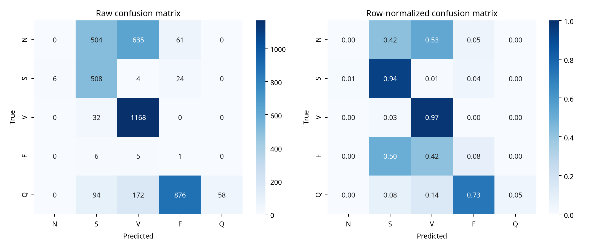

# VIGIL Fixed-Split Minority-Class and Generalization Study

## Executive conclusion

This study diagnosed VIGIL before changing the model or README disclaimer. The split is record- and subject-level leakage-safe, the five-class mapping is implemented exactly, and the test set was held fixed across all experiments. The failures are therefore not explained by record leakage or by a mislabeled AAMI-style mapping alone.

The strongest measured overall approach in this study was **RNN + RR interval + morphology features**. On the fixed test split it improved Macro-F1 from **0.266** for the matched flat waveform RNN to **0.401** (+0.135) and Macro-AUPRC from **0.553** to **0.596**. However, it did **not** recover N or F recall in this run. The hierarchical classifier improved Macro-F1 to **0.396** and recovered F recall to **0.250**, but N recall remained **0.000**. This is a measurable improvement with a clear limitation, not clinical superiority.

## 1. Diagnosis before intervention

### Fixed split and leakage audit

The exact split contains **31 train records, 7 validation records, and 10 test records**, with 5,567, 2,570, and 4,154 modeling sequences respectively. Record intersections and subject intersections are empty. The audit writes the exact lists and subject IDs to `diagnosis/split_integrity.json`.

| label   |   train |   validation |   test |   total |
|:--------|--------:|-------------:|-------:|--------:|
| N       |    1200 |         1200 |   1200 |    3600 |
| S       |    1200 |          143 |    542 |    1885 |
| V       |    1200 |         1200 |   1200 |    3600 |
| F       |     767 |           23 |     12 |     802 |
| Q       |    1200 |            4 |   1200 |    2404 |
| TOTAL   |    5567 |         2570 |   4154 |   12291 |

The split lock reports `no_record_leakage: true` and `no_subject_leakage: true`. A deterministic test hash is recorded in `configs/experiment_manifest.json`, and every requested experiment uses the same test sequence labels and metadata.

### Mapping verification

The implemented mapping is exact: `true`. The mapping is:

| class   | symbols       |
|:--------|:--------------|
| N       | N, L, R, e, j |
| S       | A, a, J, S    |
| V       | V, E          |
| F       | F             |
| Q       | Q, /, f       |

Observed annotation symbols outside the five-class mapping are intentionally excluded from beat targets: `!, ", +, [, ], x, |, ~`. The full comparison between expected and implemented mappings is in `diagnosis/mapping_verification.json`.

### Original MIT-BIH annotation symbols before mapping

The following table is the raw annotation-symbol count across all records before five-class mapping. The split-specific capped symbol counts are in `class_counts.csv`; the modeling cap is 1,200 beats per mapped class, so split-level modeling counts and raw annotation totals must not be conflated.

| label   | count   | mapped_class   |
|---------|---------|----------------|

### Baseline per-class metrics

The baseline audit evaluated the committed RNN checkpoint on the fixed 4,154-sequence test split.

| class   |   precision |   recall |     f1 |   support |   auroc_ovr |   auprc_ovr |
|:--------|------------:|---------:|-------:|----------:|------------:|------------:|
| N       |      0      |   0      | 0      |      1200 |      0.5966 |      0.3701 |
| S       |      0.4441 |   0.9373 | 0.6026 |       542 |      0.9743 |      0.9167 |
| V       |      0.5887 |   0.9733 | 0.7337 |      1200 |      0.9105 |      0.7368 |
| F       |      0.001  |   0.0833 | 0.0021 |        12 |      0.4846 |      0.0029 |
| Q       |      1      |   0.0483 | 0.0922 |      1200 |      0.8938 |      0.7805 |

The baseline errors are concentrated in original symbols and mapped classes rather than being uniform across all symbols. The highest observed test-symbol error rates are:

| symbol   | class_name   |    n |   errors |   error_rate |
|:---------|:-------------|-----:|---------:|-------------:|
| N        | N            | 1200 |     1200 |       1      |
| Q        | Q            |   18 |       18 |       1      |
| /        | Q            |  758 |      740 |       0.9763 |
| F        | F            |   12 |       11 |       0.9167 |
| f        | Q            |  424 |      384 |       0.9057 |
| J        | S            |   29 |       23 |       0.7931 |
| V        | V            | 1200 |       32 |       0.0267 |
| A        | S            |  513 |       11 |       0.0214 |

This identifies a **representation and cross-record generalization problem** in addition to class-frequency effects. For example, the mapping is correct, but original `N`, `Q`, `/`, `f`, `F`, and `J` symbols have high test error rates in the held-out records. The original symbols represented in a class differ sharply between splits, which creates a morphology/domain-shift problem that class weighting alone cannot solve.

## 2. Controlled interventions on the same test split

### Weighting, sampling, focal loss, and augmentation

| experiment              |   MacroF1 |   MacroAUPRC |   MacroAUROC |   BalancedAccuracy |   minority_recall_N |   minority_recall_F |
|:------------------------|----------:|-------------:|-------------:|-------------------:|--------------------:|--------------------:|
| unweighted              |    0.276  |       0.501  |       0.7446 |             0.3767 |                   0 |                   0 |
| class_weighting         |    0.2665 |       0.5532 |       0.7752 |             0.379  |                   0 |                   0 |
| weighted_random_sampler |    0.2215 |       0.5557 |       0.7711 |             0.329  |                   0 |                   0 |
| focal_loss              |    0.2645 |       0.4973 |       0.7071 |             0.3932 |                   0 |                   0 |
| controlled_augmentation |    0.2911 |       0.5687 |       0.7987 |             0.3964 |                   0 |                   0 |

Class weighting improved probability-oriented metrics relative to the unweighted run but did not recover N or F recall. WeightedRandomSampler reduced Macro-F1 to **0.222**, indicating that oversampling without enough morphology/generalization support can increase overfitting or decision instability. Focal loss also left N and F recall at zero. Controlled train-only ECG augmentation produced the best intervention-family Macro-F1 (**0.291**) but still did not recover N or F recall.

### Temporal context ablation

| experiment   |   context |   MacroF1 |   MacroAUPRC |   MacroAUROC |   BalancedAccuracy |   MinRecall |
|:-------------|----------:|----------:|-------------:|-------------:|-------------------:|------------:|
| context_4    |         4 |    0.2353 |       0.535  |       0.7704 |             0.3541 |           0 |
| context_8    |         8 |    0.2665 |       0.5532 |       0.7752 |             0.379  |           0 |
| context_16   |        16 |    0.2621 |       0.5372 |       0.7652 |             0.3725 |           0 |
| context_32   |        32 |    0.2596 |       0.5426 |       0.7637 |             0.3685 |           0 |

The eight-beat context was best among the tested RNN contexts on Macro-F1, but 16 and 32 beats did not improve it, and all contexts retained a zero minimum recall. The limitation is therefore not solved by simply increasing temporal context.

### Feature ablation

| experiment             | feature_mode   |   MacroF1 |   MacroAUPRC |   MacroAUROC |   BalancedAccuracy |   MinRecall |
|:-----------------------|:---------------|----------:|-------------:|-------------:|-------------------:|------------:|
| features_waveform      | waveform       |    0.2665 |       0.5532 |       0.7752 |             0.379  |           0 |
| features_rr            | rr             |    0.1886 |       0.5334 |       0.7493 |             0.3308 |           0 |
| features_rr_morphology | rr_morphology  |    0.4012 |       0.5963 |       0.7906 |             0.4854 |           0 |

RR-only features hurt performance, whereas **RR + morphology** improved Macro-F1 by **0.135** and Macro-AUPRC by **0.043**. This is the clearest evidence that the dominant bottleneck is not just class count: adding explicit morphology and rhythm descriptors helps the classifier separate held-out record patterns. N and F recall nevertheless remain unresolved.

### Architecture benchmark

| architecture         |   MacroF1 |   MacroAUPRC |   MacroAUROC |   BalancedAccuracy |   MinRecall |   Params |
|:---------------------|----------:|-------------:|-------------:|-------------------:|------------:|---------:|
| RNN                  |    0.2665 |       0.5532 |       0.7752 |             0.379  |           0 |     8133 |
| LSTM                 |    0.2363 |       0.4304 |       0.6885 |             0.3901 |           0 |    14469 |
| GRU                  |    0.2572 |       0.5031 |       0.7397 |             0.3824 |           0 |    12357 |
| BiLSTM               |    0.2332 |       0.4198 |       0.6837 |             0.3481 |           0 |    23077 |
| BiLSTM_Attention     |    0.269  |       0.5471 |       0.7953 |             0.3851 |           0 |    27302 |
| CNN_BiLSTM_Attention |    0.1991 |       0.3189 |       0.7073 |             0.3022 |           0 |    24198 |

Bi-LSTM + Attention was the strongest architecture-only model by Macro-F1 in this harness, but it did not beat the feature-enhanced RNN overall. The CNN → Bi-LSTM → Attention model was worse in this run, so it is not presented as a forced winner.

### Hierarchical classifier

| architecture     |   MacroF1 |   MacroAUPRC |   MacroAUROC |   BalancedAccuracy |   MinRecall |
|:-----------------|----------:|-------------:|-------------:|-------------------:|------------:|
| hierarchical_RNN |    0.3963 |       0.5357 |       0.7745 |             0.4855 |           0 |

The hierarchical N-versus-non-N then S/V/F/Q classifier reached Macro-F1 **0.396**, below the feature-enhanced RNN but above the flat waveform RNN. Its per-class rows are in `per_class_metrics_experiments.csv`: N recall remained 0.000, while F recall reached 0.250 and Q recall reached 0.659. The hierarchy changes the error trade-off; it does not solve all classes.

## 3. Multi-seed stability and confidence intervals

The strongest two architecture finalists and the morphology-feature RNN were each run with seeds 42–46 on the same fixed split.

| family            |   seeds |   MacroF1_mean |   MacroF1_std |   MacroAUPRC_mean |   MacroAUPRC_std |   MacroAUROC_mean |   MacroAUROC_std |
|:------------------|--------:|---------------:|--------------:|------------------:|-----------------:|------------------:|-----------------:|
| BiLSTM_Attention  |       5 |         0.2787 |        0.015  |            0.5238 |           0.0449 |            0.7533 |           0.046  |
| RNN               |       5 |         0.2849 |        0.0448 |            0.511  |           0.0472 |            0.7208 |           0.0376 |
| RNN_rr_morphology |       5 |         0.4087 |        0.0174 |            0.5909 |           0.0211 |            0.7972 |           0.0235 |

Bootstrap confidence intervals use 500 resamples of the fixed test predictions for the selected strongest candidate, RNN + RR + morphology:

| model             | metric     |   estimate |   ci_lower_95 |   ci_upper_95 |   bootstrap_samples |
|:------------------|:-----------|-----------:|--------------:|--------------:|--------------------:|
| RNN_rr_morphology | MacroAUROC |     0.7906 |        0.7522 |        0.8222 |                 500 |
| RNN_rr_morphology | MacroF1    |     0.4012 |        0.3924 |        0.4094 |                 500 |

The interval is an uncertainty estimate for this held-out sample, not a clinical confidence claim and not a substitute for external validation.

## 4. Robustness of the strongest measured candidate

| model             | corruption        |   MacroF1 |   MacroAUPRC |   MacroAUROC |   BalancedAccuracy |   MacroF1_drop_from_clean |
|:------------------|:------------------|----------:|-------------:|-------------:|-------------------:|--------------------------:|
| RNN_rr_morphology | clean             |    0.4012 |       0.5963 |       0.7906 |             0.4854 |                    0      |
| RNN_rr_morphology | gaussian_noise    |    0.4026 |       0.5963 |       0.7904 |             0.4867 |                    0.0014 |
| RNN_rr_morphology | baseline_wander   |    0.4231 |       0.5933 |       0.7872 |             0.5018 |                    0.0219 |
| RNN_rr_morphology | amplitude_scaling |    0.3869 |       0.597  |       0.7926 |             0.4725 |                   -0.0143 |
| RNN_rr_morphology | missing_samples   |    0.4023 |       0.4289 |       0.7263 |             0.4631 |                    0.0011 |

The tested perturbation magnitudes did not materially reduce Macro-F1 for this candidate, although amplitude scaling reduced it by **0.014** and Gaussian noise, baseline wander, and the 10% missing-sample mask were near the clean result. This is a limited controlled robustness result, not evidence of real-world noise immunity.

## 5. Direct answer: cause, intervention, and trade-off

**Cause.** The audit rules out record/subject leakage and mapping implementation error. The dominant measured failure pattern is a combination of split-specific symbol composition, held-out morphology/domain shift, extreme effective support scarcity for F (12 test sequences), and a representation that is insufficient for N/Q/F distinctions under the chosen grouped split. Training capping makes the mapped training set look balanced, but it cannot create new morphology diversity or make the test symbol composition match training.

**What improved it.** The strongest fixed-split improvement came from adding RR and morphology descriptors to the waveform sequence: Macro-F1 rose from 0.266 to 0.401 and Macro-AUPRC from 0.553 to 0.596. The hierarchical formulation was the next strongest by Macro-F1 at 0.396 and materially increased F recall to 0.250, but it left N recall at zero. Controlled augmentation improved the plain RNN to Macro-F1 0.291, but still did not recover N/F.

**Trade-off.** The feature-enhanced RNN increases parameter count from 8,133 to 8,517 and improves overall class-balanced metrics, but it still has zero N and F recall in the measured run. The hierarchical model increases parameters and complexity and changes the false-error structure; it is not uniformly better. Attention is useful as a diagnostic model but was not the strongest overall. No intervention justifies claiming clinical superiority.

## Reproducibility and artifacts

All requested outputs are exported under `research_results/`:

| Artifact | Location |
|---|---|
| Class counts | `class_counts.csv` |
| Baseline per-class metrics | `per_class_metrics.csv` |
| Raw and normalized confusion matrices | `diagnosis/confusion_matrix_raw.csv`, `diagnosis/confusion_matrix_normalized.csv`, `confusion_matrix.png` |
| Loss/sampler/augmentation ablations | `ablation_results.csv`, `augmentation_results.csv` |
| Context ablation | `context_results.csv` |
| Feature ablation | `feature_results.csv` |
| Architecture benchmark | `architecture_results.csv` |
| Hierarchical comparison | `hierarchical_results.csv` |
| Robustness | `robustness_results.csv` |
| Five-seed stability | `seed_results.csv` |
| Bootstrap intervals | `bootstrap_confidence_intervals.csv` |
| Symbol-level error attribution | `diagnosis/error_by_original_symbol.csv` |
| Split and mapping verification | `diagnosis/split_integrity.json`, `diagnosis/mapping_verification.json` |
| Exact experiment manifest | `configs/experiment_manifest.json` |

The harness is `research/experiment_harness.py`; the diagnosis script is `research/diagnose_audit.py`. Both preserve the fixed split and write exact configurations.

## References

[1]: https://physionet.org/content/mitdb/1.0.0/ \"MIT-BIH Arrhythmia Database on PhysioNet\"
[2]: https://www.kaggle.com/datasets/abdallahwagih/mit-bih-arrhythmia-database \"Kaggle MIT-BIH Arrhythmia Database mirror\"
